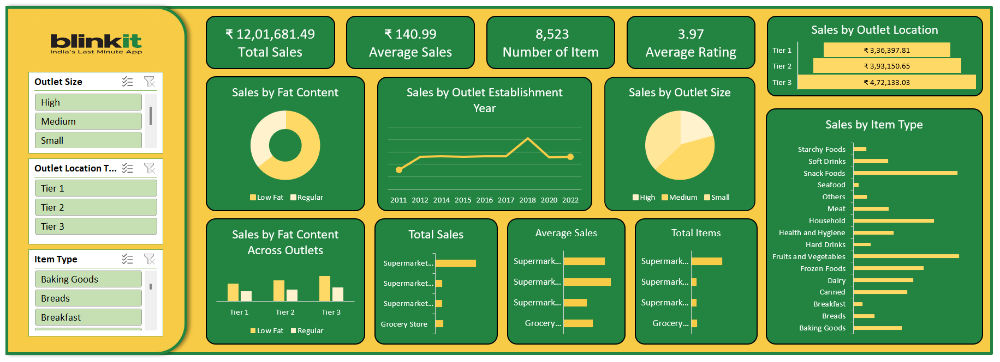

# Blinkit Sales Analysis

## Overview
This project focuses on analyzing Blinkit retail sales data to understand product demand, outlet performance, and sales distribution.

## Dataset
The dataset contains **8,500+ sales records across multiple attributes**, including product category, outlet type, and sales value.

## Tools & Technologies
- Excel

## Project Workflow
1. Data cleaning and preparation.
2. Sales trend analysis.
3. Interactive dashboard development.

## Key Insights
- Identified **high-performing product categories**.
- Analyzed **sales distribution across outlet locations**.
- Observed patterns influencing **product demand**.

## Dashboard

